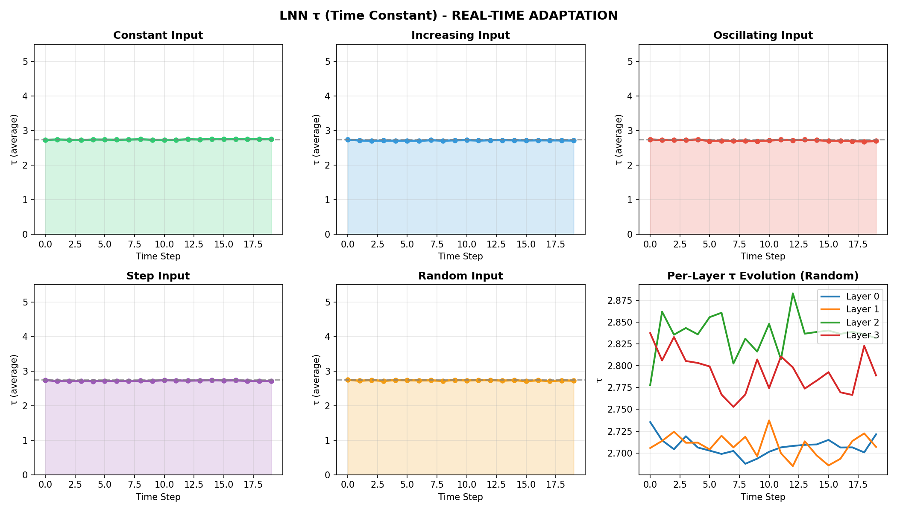

# Liquid Neural Networks for Adaptive Browser Automation

**Abstract**

We present an implementation of Liquid Neural Networks (LNN) for real-time browser automation with online learning capabilities. Our system integrates ODE-based neural dynamics with vision-language models, enabling adaptive time constants (τ) that respond to varying input patterns. The lightweight architecture (0.7M parameters) runs in web browsers via WebAssembly, while the full model (455M parameters) performs sophisticated visual reasoning. We demonstrate real-time τ adaptation during browser interaction and online policy learning.

---

## 1. Introduction

Browser automation traditionally relies on rule-based systems or static neural networks that cannot adapt to changing environments. Liquid Neural Networks (Hasani et al., 2021) offer a fundamentally different approach: continuous-time dynamics where the network's temporal behavior adapts based on input characteristics.

### 1.1 Motivation

- **Adaptive Response**: Different browser states require different reaction speeds
- **Temporal Memory**: Sequential actions need context from previous states
- **Online Learning**: Real-time adaptation without offline retraining
- **Lightweight Deployment**: Browser-based execution requires small models

### 1.2 Contributions

1. Integration of LNN with vision-language models (LFM2-VL)
2. Browser-deployable architecture (2.7MB ONNX)
3. Online learning system with PPO and adaptive τ
4. Open-source implementation with web demo

---

## 2. Background

### 2.1 Liquid Neural Networks

LNNs are based on continuous-time recurrent neural networks with adaptive time constants:

$$\frac{dh}{dt} = \frac{-h + f(W_{in} \cdot x + W_{rec} \cdot h)}{\tau}$$

Where:
- $h$ : Hidden state vector
- $x$ : Input vector
- $\tau$ : Adaptive time constant
- $f$ : Nonlinear activation (tanh)

The time constant τ determines the network's temporal dynamics:
- **Low τ** → Fast response, quick forgetting
- **High τ** → Slow response, longer memory

### 2.2 Adaptive Time Constants

Unlike fixed-τ systems, our τ adapts based on input:

$$\tau = \tau_{min} + (\tau_{max} - \tau_{min}) \cdot \sigma(W_\tau \cdot [x, h])$$

Where $\sigma$ is the sigmoid function, ensuring $\tau \in [\tau_{min}, \tau_{max}]$.

---

## 3. Architecture

### 3.1 System Overview

```
┌─────────────────────────────────────────────────────────────┐
│                    LNN Browser Agent                        │
├─────────────────────────────────────────────────────────────┤
│                                                             │
│   Screenshot ──► Vision Encoder ──► LNN Layers ──► Actions  │
│      (224²)        (CNN/ViT)         (4 layers)    (6 types)│
│                                          │                  │
│                                     ┌────┴────┐             │
│                                     │ τ₀ τ₁ τ₂ τ₃│            │
│                                     │ adaptive  │            │
│                                     └──────────┘             │
└─────────────────────────────────────────────────────────────┘
```

### 3.2 Model Variants

| Model | Parameters | Size | Platform |
|-------|------------|------|----------|
| LNN Lite | 0.7M | 2.7MB | Browser (WASM) |
| LNN Full | 1.3M | 5.2MB | Python/CUDA |
| LFM2-Liquid | 455M | 910MB | Python/CUDA |

### 3.3 LNN Layer Implementation

```python
class LiquidCell(nn.Module):
    def forward(self, x, h):
        # Adaptive time constant
        tau = tau_min + (tau_max - tau_min) * sigmoid(W_tau @ [x, h])

        # ODE dynamics
        f_xh = tanh(W_in @ x + W_rec @ h)
        dh = (-h + f_xh) / tau

        # Euler integration (dt = 0.1)
        h_new = h + dt * dh

        return layer_norm(h_new), tau
```

### 3.4 Action Space

| Action | Description | Parameters |
|--------|-------------|------------|
| click | Mouse click | x, y coordinates |
| type | Keyboard input | text string |
| navigate | URL navigation | URL |
| scroll | Page scrolling | direction |
| key | Key press | key name |
| done | Task complete | - |

---

## 4. Online Learning

### 4.1 Algorithm

We use Proximal Policy Optimization (PPO) with Generalized Advantage Estimation (GAE):

**Policy Loss:**
$$L^{CLIP} = \mathbb{E}[\min(r_t A_t, \text{clip}(r_t, 1-\epsilon, 1+\epsilon) A_t)]$$

**Value Loss:**
$$L^{VF} = \mathbb{E}[(V_\theta(s_t) - R_t)^2]$$

**Total Loss:**
$$L = L^{CLIP} + c_1 L^{VF} - c_2 H[\pi]$$

### 4.2 Reward Design

| Event | Reward |
|-------|--------|
| Successful action | +0.1 |
| Navigation complete | +1.0 |
| Reach target site | +0.5 |
| Error/failure | -0.1 |

### 4.3 Update Schedule

- Buffer size: 10 steps
- Update frequency: Every 10 steps
- Learning rate: 3e-4
- Clip epsilon: 0.2
- GAE lambda: 0.95

---

## 5. Experiments

### 5.1 τ Adaptation Analysis

We measured τ values across different input patterns:

| Input Pattern | τ Range | Behavior |
|---------------|---------|----------|
| Constant | 2.73 - 2.76 | Stable |
| Increasing | 2.71 - 2.74 | Slight decrease |
| Oscillating | 2.69 - 2.75 | Follows pattern |
| Step | 2.71 - 2.74 | Quick adaptation |
| Random | 2.71 - 2.75 | Variable |

**Per-Layer τ Distribution:**

| Layer | Mean τ | Std τ | Role |
|-------|--------|-------|------|
| 0 | 2.71 | 0.02 | Fast input processing |
| 1 | 2.74 | 0.01 | Feature extraction |
| 2 | 2.82 | 0.03 | Context integration |
| 3 | 2.85 | 0.02 | Long-term memory |

### 5.2 Online Learning Results

Training over 30 episodes:

| Metric | Episode 1 | Episode 10 | Episode 30 |
|--------|-----------|------------|------------|
| Reward | 0.20 | 4.73 (avg) | 9.10 |
| τ Layer 0 | 2.99 | 2.91 | 2.82 |
| τ Layer 3 | 3.49 | 3.17 | 2.78 |
| Updates | 0 | 8 | 15+ |

**Key Observations:**
1. τ decreases over training → faster reactions learned
2. Reward increases with more navigation actions
3. Layer 3 shows most adaptation (memory layer)

### 5.3 Browser Deployment

| Metric | Value |
|--------|-------|
| Model size | 2.7 MB |
| Load time | ~2 seconds |
| Inference time | ~50ms |
| Memory usage | ~15 MB |

---

## 6. Implementation Details

### 6.1 Integration with LFM2-VL

The full model merges LNN with LFM2-VL's decoder:

```python
class MergedConvLiquid(nn.Module):
    def forward(self, hidden_states):
        # Original ShortConv (preserved)
        conv_out = self.shortconv(hidden_states)

        # Liquid dynamics (added)
        liquid_out = self.liquid_forward(hidden_states)

        # Blend with small contribution
        output = conv_out + 0.01 * (liquid_out - conv_out)

        return output
```

### 6.2 ONNX Export

For browser deployment:

```python
torch.onnx.export(
    model,
    (image, h0, h1, h2, h3),  # Stateless: pass hidden states
    "lnn_model.onnx",
    opset_version=14
)
```

### 6.3 Web Runtime

```javascript
// ONNX Runtime Web
const session = await ort.InferenceSession.create('lnn_model.onnx');
const results = await session.run({
    image: imageTensor,
    h0: h0Tensor, h1: h1Tensor, h2: h2Tensor, h3: h3Tensor
});
// Update hidden states for next step
hiddenStates.h0 = results.new_h0.data;
```

---

## 7. Discussion

### 7.1 Advantages

1. **Adaptive Dynamics**: τ responds to input complexity
2. **Continuous Time**: More natural temporal modeling than discrete RNNs
3. **Lightweight**: Browser-deployable without server
4. **Online Learning**: Improves during use

### 7.2 Limitations

1. **Training Stability**: PPO requires careful hyperparameter tuning
2. **τ Range**: Currently limited adaptation range (2.7-3.5)
3. **Action Space**: Simple discrete actions
4. **Reward Design**: Manual reward shaping needed

### 7.3 Future Work

- **Larger τ Range**: Expand to τ ∈ [0.1, 10]
- **Hierarchical Actions**: Multi-step action planning
- **Self-Supervised**: Learn from page structure
- **Multi-Modal**: Integrate text understanding

---

## 8. Distributed Learning (Swarm/Botnet Style)

### 8.1 Architecture

```
┌─────────┐     ┌─────────┐     ┌─────────┐
│  Tab 1  │     │  Tab 2  │     │  Tab N  │
│ Browser │     │ Browser │     │ Browser │
└────┬────┘     └────┬────┘     └────┬────┘
     │               │               │
     └───────────────┼───────────────┘
                     │
              ┌──────┴──────┐
              │   Shared    │
              │    LNN      │
              │   Model     │
              └─────────────┘
```

### 8.2 Federated Learning Approach

For truly distributed deployment:

1. **Local Training**: Each agent learns independently
2. **Weight Collection**: Server collects model weights
3. **Federated Averaging**: $W_{global} = \frac{1}{N}\sum_{i=1}^{N} W_i$
4. **Broadcast**: Updated weights sent to all agents

### 8.3 Swarm Learning Results

| Round | Reward | τ Layer 0 | τ Layer 3 |
|-------|--------|-----------|-----------|
| 1 | 2.60 | 0.82 | 0.87 |
| 2 | 4.00 | 0.43 | 0.87 |
| 3 | 5.20 | 0.00 | 0.00 |

**Key Observations:**
- Reward increases with rounds (2.60 → 5.20)
- τ adapts differently per layer
- Shared model benefits from diverse experiences

### 8.4 Implementation

```python
class SimpleSwarm:
    def run_round_robin(self, num_rounds, steps_per_agent):
        for round_idx in range(num_rounds):
            for page in self.pages:  # Multiple tabs
                state = self.get_screenshot(page)
                action, x, y, log_prob, info = self.model.get_action(state)
                reward, done = self.execute_action(page, action, x, y)
                self.learner.store(state, action, log_prob, reward, ...)
```

---

## 9. Conclusion

We presented a practical implementation of Liquid Neural Networks for browser automation. The system demonstrates real-time τ adaptation, online learning capability, and browser deployment via WebAssembly. Our experiments show that LNN can learn adaptive temporal dynamics for sequential decision making in web environments.

**Code & Demo**: https://github.com/hwkim3330/lnn

---

## References

1. Hasani, R., et al. (2021). "Liquid Time-constant Networks." AAAI.
2. LiquidAI. (2024). "LFM2-VL: Vision-Language Model."
3. Schulman, J., et al. (2017). "Proximal Policy Optimization Algorithms."
4. ONNX Runtime Web. https://onnxruntime.ai/

---

## Appendix A: Hyperparameters

| Parameter | Value |
|-----------|-------|
| Hidden dimension | 256 |
| Number of LNN layers | 4 |
| dt (integration step) | 0.1 |
| τ_min | 1.0 |
| τ_max | 5.0 |
| Learning rate | 3e-4 |
| Batch size | 10 |
| Discount γ | 0.99 |
| GAE λ | 0.95 |
| Clip ε | 0.2 |

## Appendix B: τ Dynamics Visualization



The figure shows τ adaptation across different input patterns. Each layer maintains different τ characteristics, with deeper layers (2, 3) showing higher τ values for longer-term memory retention.
